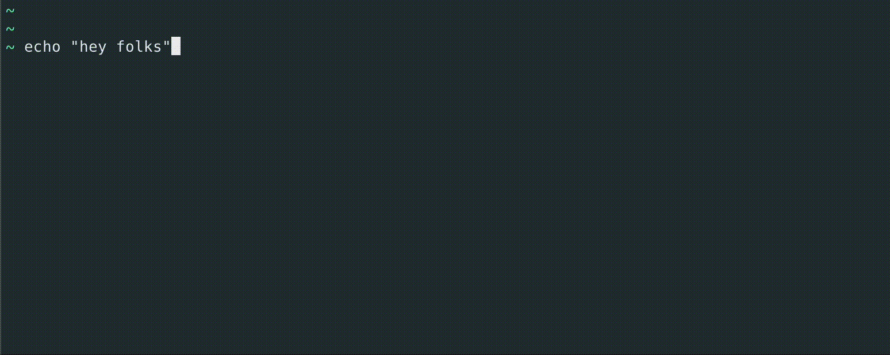

# venv-manager



## Install

```
curl -s https://raw.githubusercontent.com/rrossmiller/venv-manager/main/bin/install.sh | /bin/zsh
```

Copy the function that it prints out into your ~/.zhsrc or bashrc
```
function venv(){
    clear
    govenv $@
    if [[ $? -eq 0 ]]; then
        eval `tail -n 1 ~/.venv/history`
        clear
    fi
}
```
```
source ~/.zshrc #(or bash)
venv
```


<!-- 
Manage venv's

Enter or create env

```
> venv env1

Python 3.11.0
(env1) >
```

Create venv with specific version

```
> venv env2 -c 10
Python 3.10.6
(env2) >
```

delete envs (deactivate then delete if in use)

```
venv -d env2
``` -->
